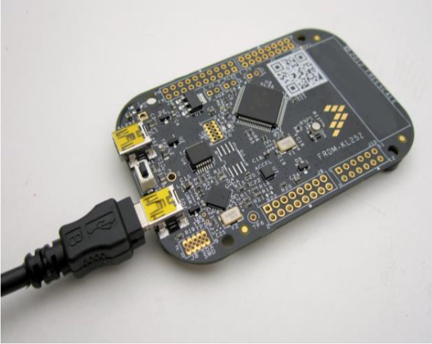
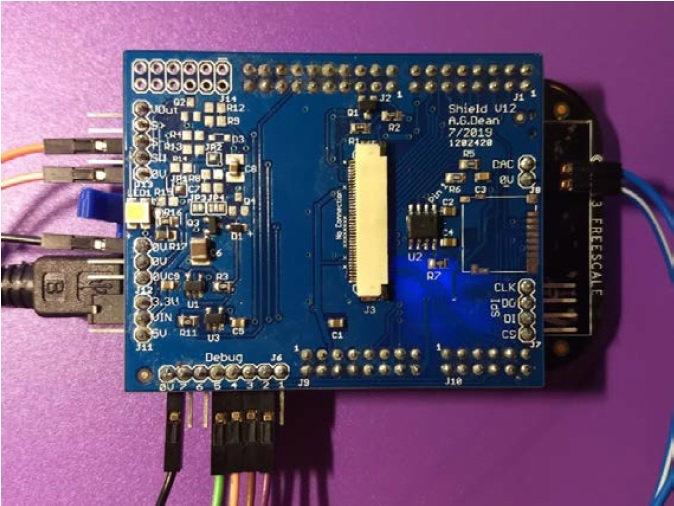
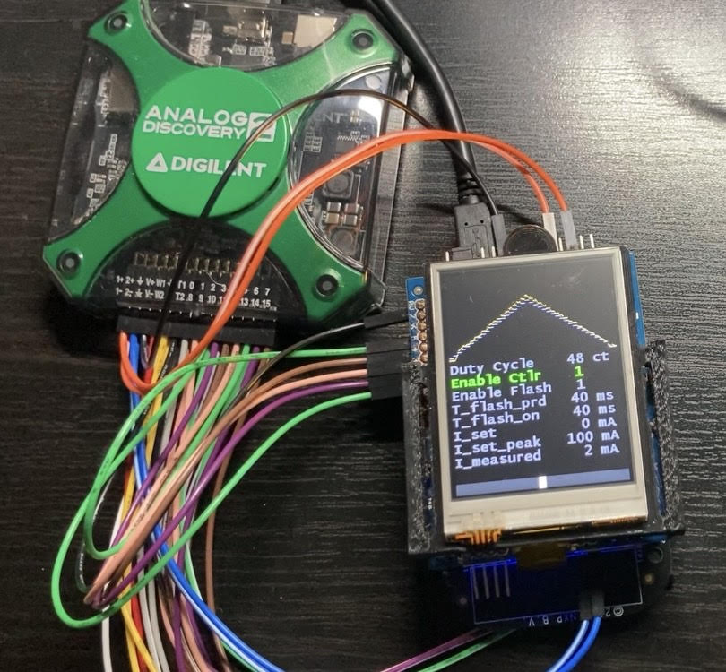

# **Projects**

The following repository contains an overview and collection of technical projects I have completed throught my undergrad in NCSU as a Computer Engineer and personal projects. The links for each project's repository have more detailed descriptions, documentation, source code, testing, and conclusions of these projects.

These projects are intended to show my engineering capabilities and problem solvitn from a range of topics such as Hardware Description Languages (HDL), Embeded Systems Programming and Debugging, and Machine Learning concepts and projects.

## **Projects:**

### **[1) Embedded Systems "Shields Up" Project](https://github.com/YuviniVelasquez/embedded_systems_shields_up.git)**

In creating and designing a robust embedded system, there are many errors and faults that need to be prevented and managed. These can be internal or external faults such as exploit attacks, device failures, bad programming practices, or even change of bits because of solar flare.

Freedom Development Board

Shield PCB with Debugging Setup

Freedom board with PCB, LCD, and AD2 as oscilloscope

In this project, I modified the code provided that controlled a Freedom Developing board with NXP Kinetis processor with an LCD display and I handled the most common errors in Embedded Systems. I layed out my debugging process, the tools I used, provided with videos or oscilloscope screenshots to view the bugs, and I analized the efficiency of the solution I proposed.

