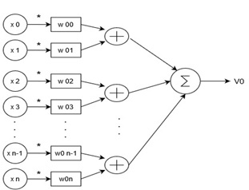
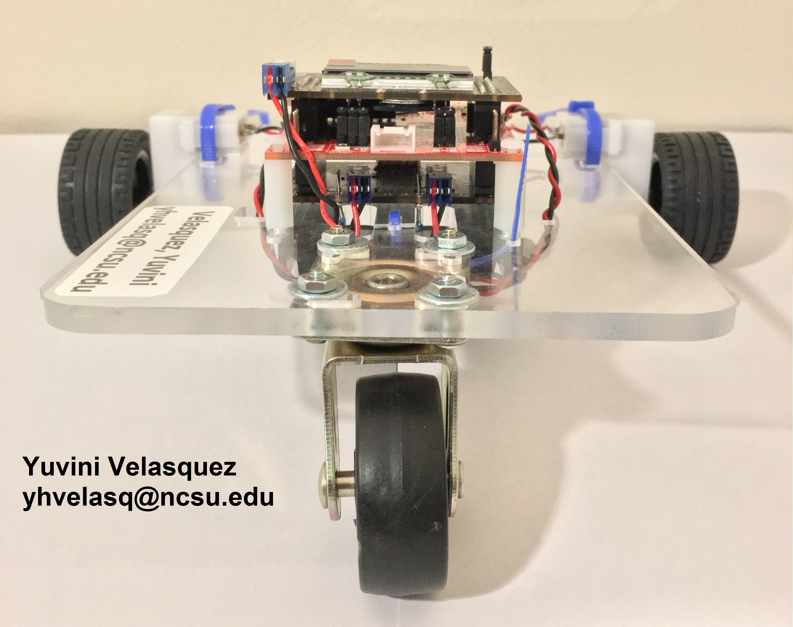
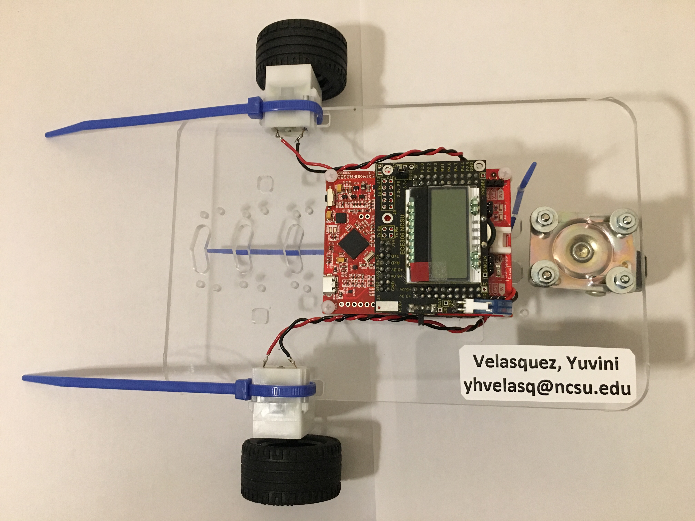
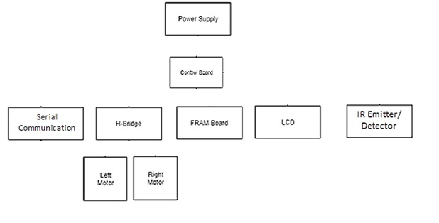

# **Projects**

The following repository contains an overview and collection of technical projects I have completed throught my undergrad in NCSU as a Computer Engineer and personal projects. The links for each project's repository have more detailed descriptions, documentation, source code, testing, and conclusions of these projects.

These projects are intended to show my engineering capabilities and problem solvitn from a range of topics such as Hardware Description Languages (HDL), Embeded Systems Programming and Debugging, and Machine Learning concepts and projects.

# Table of Content
1. [Embedded Systems "Shields Up" Project](#project1)
2. [HDL One Layer Neural Network](#hdlproject)
3. [Line Detecting MCU Motorized Vehicle](#mcuproject)

## **Projects:**

### **[1) Embedded Systems "Shields Up" Project ](https://github.com/YuviniVelasquez/embedded_systems_shields_up.git)** 

### An analysis, debugging, and managment of software errors in embedded systems.

 There are many errors and faults that need to be prevented and managed when creating and designing a robust embedded system,. These can be internal or external faults such as exploit attacks, device failures, bad programming practices, or even change of bits because of solar flare.

<table>
  <tr style="text-align:center">
    <td>Freedom Development Board</td>
     <td>Shield PCB with Debugging Setup</td>
     <td>Freedom board with PCB, LCD, and AD2 as oscilloscope</td>
  </tr>
  <tr>
    <td></td>
    <td></td>
    <td></td>
  </tr>
 </table>

In this project, I modified the code provided that controlled a Freedom Developing board with NXP Kinetis processor with an LCD display and I handled the most common errors in Embedded Systems. I layed out my debugging process, the tools I used, provided with videos or oscilloscope screenshots to view the bugs, and I analized the efficiency of the solution I proposed.

### **[2) HDL One Layer Neural Network ](https://github.com/YuviniVelasquez/hdl_one_layer_neural_network.git)** 

The use of hardware acceleration to train Deep Neural Networks is an approach that aims to reduce the great computer power that traditionally is used with other training forms such as GPUs and CPUs. The following report presents a design to calculate a one level network by implementing a Multiply Accumulator (MAC) and two 8-bit parallel multipliers as a hardware solution to train DNN’s.

This approach intended to use the parallelism avaiable in FPGAs and ASICs. 
The achievement of this design is that it is a synthesizable design that runs at a clock speed twice as fast than given in the test bench thanks to the use of parallelism. The performance and the area has been optimized and the results are presented in the linked documents.

<table>
  <tr>
    <td></td>
    <td></td>
  </tr>
  <tr style="text-align:center">
    <td>Summation to obtain Hyperparameter with proposed design</td>
    <td>Designed IO Diagram</td>
  </tr>
 </table>

### **[3) Line Detecting MCU Motorized Vehicle ](https://github.com/YuviniVelasquez/line_detecting_mcu_motorized_vehicle.git)** 
## An Embedded Systems Project with an Extreme Learning Curve

**Note** A full documentation of this project can be seen in the wiki of the repository

The following project is an Embedded Systems porject where that involved creation and documentation of electrical circuits, hardware components, software, and procedures behind the development of an Autonomous Line Detecting Electric Unmanned Motorized Vehicle using the MSP430 development kit. 

The car is designed to locate, align path of travel, recognize, and maintain focus of, and finally follow a black line through a course autonomously.  During the production of the car, the team has several milestones, a number of which are merely to establish functionality and proof of concept.

The project was commissioned in Fall 2019. It was to be completed within 14 weeks. Deadlines were established to keep record of the progress. These deadlines were spread throughout the 14 weeks, usually with a week to two weeks between deadlines. 

<table>
  <tr>
    <td></td>
    <td></td>
  </tr>
  <tr style="text-align:center">
    <td>Front View of Line Detecting Car</td>
    <td>Top View of Line Detecting Car</td>
  </tr>
 </table>

The vehicle consists of a 4 AA battery power supply, a control board with power circuit, two H-bridges that switch the direction of supplied voltage and allows for left and right motors, the MSP-EXP430FR2355 FRAM board, an IR emitter and IR detector, and an LCD display.

Overview Block Diagram

 Overall the ability to problem solve, stress management skills, debugging, and engineering skills were undoubtedly refined with this project.

